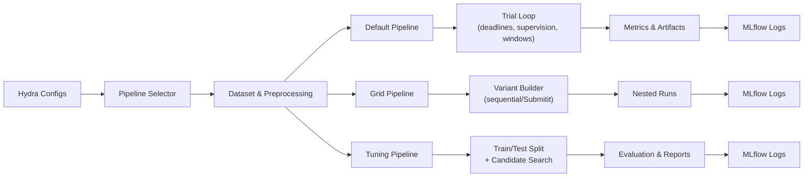

# Time Series Segmentation Experiments (tsseg-exp)

Experiment harness for the `tsseg` library. It provides reproducible pipelines, MLflow logging, and Hydra-driven configuration for time-series segmentation research.

## Features
- Hydra configuration tree for datasets, algorithms, metrics, and launchers.
- MLflow experiment tracking with automatic parameter, metric, and artifact logging.
- Multiple execution pipelines: default single run, grid search sweeps, and dataset-aware tuning.
- Submitit/SLURM integration for distributing grid searches across a cluster.
- Preprocessing hooks, timeout handling, and structured output directories for reproducibility.

## Pipeline Overview



### Pipeline Summaries
- **Default pipeline:** Executes a single dataset/algorithm pairing, applies per-trial supervision overrides and FFT-derived windows for periodic datasets, and logs nested MLflow runs with aggregated metrics.
- **Grid pipeline:** Generates cartesian combinations from `algorithm.tunable_parameters`, respects deadline budgets, and can evaluate variants sequentially or via Submitit/SLURM workers.
- **Tuning pipeline:** Splits trials into train/test partitions, searches tagged hyperparameters against a chosen metric, and records best configuration, split summaries, and search history in MLflow.

## Installation

The project expects a working conda installation. From the `tsseg-exp` repository root run:

```bash
make install
```

This command will:
1. Create (or update) the `tsseg-env` environment from `environment.yml`.
2. Install `tsseg` in editable mode (required by the experiments).
3. Install `tsseg-exp` itself in editable mode along with all optional extras.

Activate the environment once the installation finishes:

```bash
conda activate tsseg-env
```

## Quick Start

Launch the default legacy pipeline (defined in `configs/config.yaml`):

```bash
python src/tsseg_exp/main.py
```

However, it is recommended to use **Experiments** to run predefined configurations:

```bash
python src/tsseg_exp/main.py experiment=unsupervised dataset=mocap algorithm=clasp
```

Hydra writes outputs under `outputs/<date>/<time>/` and mirrors logs to MLflow.

## Example Workflows

### Standard Experiments

The project defines several experiment modes in `configs/experiment/`:

- `unsupervised`: Standard run without labels (CPD/State validation).
- `semi_supervised`: Runs with partial labels (Guided algorithms).
- `grid_unsupervised`: Grid search over tunable parameters (Unsupervised).
- `grid_supervised`: Grid search over tunable parameters (Supervised).

Run a specific experiment:

```bash
python src/tsseg_exp/main.py experiment=semi_supervised algorithm=ticc dataset=actrectut
```

### Run a Different Algorithm or Dataset

Override Hydra options on the command line:

```bash
python src/tsseg_exp/main.py experiment=unsupervised algorithm=time2state dataset=mocap
```

Multiple values can be explored with Hydra multirun:

```bash
python src/tsseg_exp/main.py --multirun experiment=unsupervised algorithm=autoplait,ticc dataset=has,usc-had
```

### Grid Search Pipeline

You can run grid searches using the experiment presets.

Sequential execution (runs in-process, useful for debugging):

```bash
python src/tsseg_exp/main.py experiment=grid_unsupervised grid.force_sequential=true
```

Submitit + SLURM execution (one job per combo):

```bash
python src/tsseg_exp/main.py experiment=grid_unsupervised hydra/launcher=submitit_slurm
```

### Hyperparameter Tuning Pipeline

The tuning pipeline splits trials into train/test partitions and performs a metric-driven search. This is often handled by `experiment=grid_supervised` or `experiment=grid_unsupervised` depending on the goal, but can be invoked manually:

```bash
python src/tsseg_exp/main.py +pipeline=tuning tuning.train_fraction=0.7
```

## Analysis and Benchmarking

The `benchmark/` folder contains Jupyter notebooks for analyzing results stored in MLflow.

### `qualitative_evaluation.ipynb`
This is the main entry point for generating paper-ready figures.
- **Visualizations**:
  - `plot_custom`: Boxplots of performance metrics (F1, Covering, etc.).
  - `plot_scatter`: Efficiency Frontier (Quality vs Time) and CP vs State performance.
  - `plot_tuning_gain`: Visualizes the uplift from default parameters to grid-searched best parameters.

## Configuration Tips

- Inspect `configs/` for available datasets, algorithms, metrics, and Hydra launchers.
- Add new algorithms by creating a YAML file under `configs/algorithm/` and listing default plus tunable parameters.
- `mlruns/` and `outputs/` directories may grow quickly—periodically prune or point MLflow to a remote server via `MLFLOW_TRACKING_URI` (already supported in `configs/hydra/launcher/submitit_slurm.yaml`).

## Troubleshooting

- Failing Submitit jobs usually log details under `outputs/<date>/<time>/submitit_grid_jobs/`.
- To debug Hydra overrides, prepend `hydra.verbose=true` or set `HYDRA_FULL_ERROR=1`.
- If a dataset loader cannot locate data, verify the `data/` directory mirrors the layout expected by the loader in `src/tsseg_exp/datasets/`.
