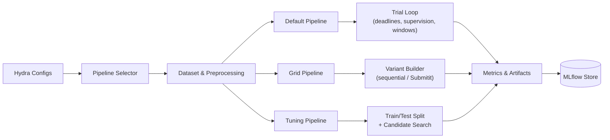

# tsseg-exp — Time Series Segmentation Experiments

<p align="center">
  <a href="https://www.python.org/downloads/"></a>
  <a href="https://hydra.cc/"></a>
  <a href="https://mlflow.org/"></a>
  <a href="https://slurm.schedmd.com/"></a>
  <a href="https://github.com/astral-sh/ruff"></a>
  <a href="LICENSE"></a>
</p>

Reproducible experiment harness for the `tsseg` library. Combines **Hydra** configuration, **MLflow** tracking, and **SLURM** distribution for large-scale time-series segmentation benchmarks.

---

## Table of Contents

- [tsseg-exp — Time Series Segmentation Experiments](#tsseg-exp--time-series-segmentation-experiments)
  - [Table of Contents](#table-of-contents)
  - [Features](#features)
  - [Architecture](#architecture)
  - [Installation](#installation)
  - [Quick Start](#quick-start)
  - [Experiment Workflows](#experiment-workflows)
    - [Experiment presets](#experiment-presets)
    - [Override any dimension](#override-any-dimension)
  - [MLflow Tracking](#mlflow-tracking)
    - [Local usage](#local-usage)
    - [URI resolution order](#uri-resolution-order)
  - [Cluster Deployment (SLURM)](#cluster-deployment-slurm)
    - [Option A — SQLite backend (simple)](#option-a--sqlite-backend-simple)
    - [Option B — PostgreSQL backend (robust)](#option-b--postgresql-backend-robust)
    - [Shortcut installation](#shortcut-installation)
    - [Connecting experiments to the server](#connecting-experiments-to-the-server)
  - [Configuration Reference](#configuration-reference)
    - [Directory layout](#directory-layout)
    - [Adding a new algorithm](#adding-a-new-algorithm)
    - [Environment variables](#environment-variables)
  - [License](#license)

---

## Features

| Area | Details |
|------|---------|
| **Configuration** | Hydra config tree for datasets, algorithms, metrics, and launchers |
| **Tracking** | MLflow logging — parameters, metrics, artifacts, nested runs |
| **Pipelines** | Default (single run), Grid (parameter sweep), Tuning (train/test search) |
| **Distribution** | Submitit / SLURM integration with fire-and-forget mode |
| **Databases** | SQLite (local, WAL-hardened) or PostgreSQL (cluster) |
| **Algorithms** | 30+ detectors including TiRex, ClaSP, BOCPD, TICC, BinSeg, … |
| **Datasets** | 12 benchmarks: UTSA, MoCap, USC-HAD, PAMAP2, SKAB, TSSB, … |

---

## Architecture



**Pipeline summaries:**

- **Default** — Runs a single dataset × algorithm pairing. Per-trial supervision overrides, FFT-derived windows for periodic data, adaptive timeouts. Returns `ExperimentResult`.
- **Grid** — Builds a cartesian product from `algorithm.tunable_parameters`. Evaluates variants sequentially or via SLURM workers (fire-and-forget). Each combo is a nested MLflow run.
- **Tuning** — Splits trials into train/test, searches hyperparameters against a chosen metric, logs the best configuration and search history.

---

## Installation

> **Prerequisites:** [conda](https://docs.conda.io/) (Miniconda or Miniforge).

```bash
git clone https://github.com/ANONYMOUS_PLACEHOLDER/tsseg-exp.git
cd tsseg-exp

cp .env.example .env          # ← edit paths for your machine
make install                   # creates conda env + installs tsseg + tsseg-exp
conda activate tsseg-env
```

`make install` will:
1. Create (or update) the `tsseg-env` environment from `environment.yml`.
2. Install [`tsseg`](https://github.com/ANONYMOUS_PLACEHOLDER/tsseg) in editable mode.
3. Install `tsseg-exp` in editable mode with dev extras.

---

## Quick Start

```bash
# Single experiment
python src/tsseg_exp/main.py algorithm=clasp dataset=mocap experiment=unsupervised

# Multirun (Hydra sweep)
python src/tsseg_exp/main.py --multirun algorithm=autoplait,ticc dataset=has,usc-had

# Grid search (sequential, for debugging)
python src/tsseg_exp/main.py experiment=grid_unsupervised grid.force_sequential=true

# Grid search (SLURM, one job per combo)
python src/tsseg_exp/main.py experiment=grid_unsupervised hydra/launcher=slurm
```

Hydra writes outputs to `outputs/<date>/<time>/` and logs everything to MLflow.

---

## Experiment Workflows

### Experiment presets

| Preset | Config | Description |
|--------|--------|-------------|
| Unsupervised | `experiment=unsupervised` | Standard run, no ground-truth labels |
| Semi-supervised | `experiment=semi_supervised` | Guided by partial labels |
| Grid (unsupervised) | `experiment=grid_unsupervised` | Sweep `tunable_parameters` |
| Grid (supervised) | `experiment=grid_supervised` | Sweep with label-guided overrides |

### Override any dimension

```bash
python src/tsseg_exp/main.py \
    experiment=semi_supervised \
    algorithm=clasp \
    dataset=utsa \
    preprocessing=default \
    metric=default
```

---

## MLflow Tracking

Experiment results are persisted via MLflow. The backend is selected through environment variables in your `.env` file (see [.env.example](.env.example)):

| Mode | `MLFLOW_TRACKING_URI` | Best for |
|------|----------------------|----------|
| **Local file store** | *(unset — default)* | Quick single-user experiments (`./mlruns/`) |
| **Local SQLite** | `sqlite:///path/to/mlflow.db` | Single machine, queryable. WAL + busy_timeout applied automatically |
| **Remote server** | `http://<host>:15050` | Cluster work with shared UI (see below) |

### Local usage

```bash
make mlflow-server             # Start local MLflow server (SQLite)
make mlflow-ui                 # Open UI in browser
make mlflow-stop               # Stop the server
make mlflow-status             # Print current tracking config
```

### URI resolution order

The pipeline resolves the tracking URI in this order:

1. **`MLFLOW_TRACKING_URI`** set in `.env` or environment → used directly.
2. **Auto-discovery** via `TSSEG_MLFLOW_DIR` → reads `mlflow_node.txt` written by the cluster server → builds `http://<host>:15050`.
3. **Fallback** → local `./mlruns/` file store (+ warning if inside SLURM).

---

## Cluster Deployment (SLURM)

The `scripts/` directory contains everything needed to run an MLflow server on a SLURM compute node and connect to it via SSH tunnel.

### Option A — SQLite backend (simple)

Best for single-user or moderate concurrency. WAL journal mode and 30 s busy_timeout are applied automatically.

```bash
# From your LOCAL machine (with SSH access to the cluster):
./scripts/submit_mlflow.sh

# Or use the shortcut (if installed):
submit_mlflow
submit_mlflow -v               # verbose mode (interactive tunnel)
```

**What happens:**
1. Checks for an existing MLflow SLURM job.
2. Submits `run_mlflow.sbatch` if none found (partition `cpu_devel`, 150 h, 8 GB RAM).
3. Waits for the server port to become available.
4. Opens an SSH tunnel `localhost:15050 → <compute-node>:15050`.
5. Opens the MLflow UI in your browser.

**SLURM resources:** `run_mlflow.sbatch`

| Parameter | Value |
|-----------|-------|
| Partition | `cpu_devel` |
| Time | 150 h |
| CPUs | 2 |
| Memory | 8 GB |
| Port | 15050 |

### Option B — PostgreSQL backend (robust)

Recommended for high-concurrency workloads (many parallel SLURM writers). Uses Apptainer/Singularity to run PostgreSQL alongside MLflow.

```bash
./scripts/submit_mlflow_pg.sh
```

**Prerequisites:**
```bash
# Pull the PostgreSQL image once:
apptainer pull /scratch/$USER/tsseg-exp/postgres.sif docker://postgres:15-alpine
```

**SLURM resources:** `run_mlflow_pg.sbatch`

| Parameter | Value |
|-----------|-------|
| Partition | `cpu_devel` |
| Time | 150 h |
| CPUs | 4 |
| Memory | 16 GB |
| MLflow port | 15051 |
| PostgreSQL port | 5434 (internal) |

### Shortcut installation

```bash
ln -sf "$(pwd)/scripts/submit_mlflow.sh" ~/.local/bin/submit_mlflow
# Ensure ~/.local/bin is in your $PATH
```

### Connecting experiments to the server

Once the server is running, experiments auto-discover it:

```bash
# In your .env:
TSSEG_MLFLOW_DIR=/scratch/<user>/tsseg-exp

# Then run experiments normally — the URI is resolved automatically:
python src/tsseg_exp/main.py algorithm=clasp dataset=mocap
```

Or set the URI explicitly:
```bash
export MLFLOW_TRACKING_URI=http://<compute-node>:15050
```

---

## Configuration Reference

### Directory layout

```
configs/
├── config.yaml              # Root config (defaults)
├── algorithm/               # 30+ algorithm configs (one YAML per detector)
├── dataset/                 # 12 dataset configs
├── experiment/              # Preset experiment modes
├── metric/                  # Metric configurations
├── pipeline/                # Pipeline selection (default, clustering)
├── preprocessing/           # Preprocessing hooks
└── hydra/launcher/          # SLURM launcher config
```

### Adding a new algorithm

Create `configs/algorithm/my-algo.yaml`:

```yaml
name: my-algo
task: change_point             # or "state"

instance:
  _target_: tsseg.algorithms.my_module.MyDetector
  param_a: 5
  param_b: "auto"

tunable_parameters:
  - param_a: [3, 5, 10]
  - param_b: ["auto", "fixed"]
```

### Environment variables

| Variable | Description |
|----------|-------------|
| `MLFLOW_TRACKING_URI` | Explicit MLflow URI (takes precedence) |
| `TSSEG_MLFLOW_DIR` | Directory for auto-discovery of cluster server |
| `CONDA` | Path to conda executable (if not in `$PATH`) |
| `HYDRA_FULL_ERROR=1` | Show full Hydra error traces |

---

## License

This project is licensed under the [GNU Affero General Public License v3.0](LICENSE).
